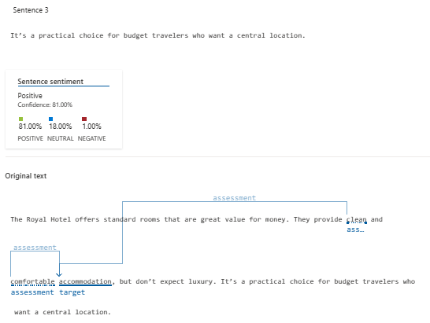

# Natural-Language-in-Azure-ML
Esse repositório contém uma breve introdução das funcionalidade de fala e linguagem da IA de Machine Learning do Azure, dando uma melhor embassamento no âmbito de leitura de um texto, e com base nele ter uma análise das emoções possivelmente contidas no mesmo

## Speech Studio
Esse site (https://speech.microsoft.com/portal), como o próprio nome já diz, tem um enfoque grande na questão de analisar aúdios de fala e retornar algo como conversão da fala para texto, tradução de fala, avaliação de pronúncia e entre outros
1. Para começar a utilizá-lo, você deve clicar na "engrenagem" no canto superior direito 

2. Clicando na mesma, você será direcionado para a aba de configurações. Neste momento não existe nenhum recurso para isso, assim é necessário clicar em "Criar novo recurso"

3. Assim, é necessário colocar o nome do recurso, o tipo de preço que será o padrão S0 (o gratuito) e o grupo de recursos (caso não tenha, existe a opção de criar um) e apertar no botão Azure para criá-lo

4. Criando nele, é somente o selecionar e clicar em "usar o recurso"

5. Agora, é possível você utilizar a ferramenta! Para uma pequena demonstração, irei descer um pouco o tela inicial do site até a opção de "Conversão de fala em texto em tempo real" e clicar no link azul

6. Automaticamente que entrar nessa funcionalidade, o sistema irá identificar o recurso criado e selecionado e pedir uma confirmação que isto poderá gastar crédito da sua conta. Referente a questão da caixa de seleção, ele se refere a que idioma é o arquivo.

7. Abaixo disso, terá de um lado uma seção você passar um arquivo de aúdio (ou gravar um aúdio) e do outro lado a demonstração do resultado em tempo real (para ser feito isso, é somente clicar no botão que está em pause e resumí-lo)

## Language Studio
O Language Studio tem um objetivo semelhante ao Speech Studio, contudo o enfoque dele é na leitura de documentos ou textos, em que ele irá analizá-los e retornar dados como conversão de texto para fala, tradução e entre outros.
1. Indo para a tela inicial do Portal do Azure, você deve fazer aquele processo padrão que possivelmente já está acostumado: Clicar em criar um novo recurso ou create a new resource, escolher a categoria AI + Machine Learning e dessa vez escolher o Language Service e clicar no criar ou create

2. Vendo essa tela, é só seguir em frente pelo continue to create your resource ou continuar para criar o seu recurso (não é necessário alterar nada)

3. Semelhante a ferramenta de análise de imagens, você deve colocar o grupo de recurso, o nome, o tier de preço e selecionar a caixa de seleção do nota de uso responsável de IA e clicar em Review + Create e depois em create

4. Finalizando a criação de recursos, você deve ir ao Language Studio. Ao ir para lá, ele pedirá para você pedir o tipo de recurso (nesse caso o Language) e o nome do recurso criado agora à pouco e clicar em done

5. Entrando na tela inicial do estúdio, irei demonstrar um leve exemplo do funcionamento dessa ferramenta também pelo Analyze sentiment and mine opinions (Analizar sentimento e opiniões)

6. Essa funcionalidade verifica e demonstra os sentimentos da pessoa que criou o texto, dando notas de porcentagem de sentimentos/emoções positivas, neutras e negativas, junto com a porcentagem de certeza e as palavras de cada frase que a demonstram, como se pode ver abaixo

Nota: caso queira testar também isso, o texto utilizado está abaixo:
<code>Tired hotel with poor service
 The Royal Hotel, London, United Kingdom
 5/6/2018  
 This is an old hotel (has been around since 1950's) and the room furnishings are average - becoming a bit old now and require changing. The internet didn't work and had to come to one of their office rooms to check in for my flight home. The website says it's close to the British Museum, but it's too far to walk.</code>

## Breves resultados de amostras do Language Studios
Só irei demonstrar algumas, mas todas as outras estão no diretório do repo em <code>inputs/senteces.txt</code>

### Amostra 1
<code>I had a delightful stay at The Royal Hotel. The location in Russell Square is fantastic, with easy access to major attractions. The British Museum is just a short walk away. The rooms were clean and comfortable, and the staff was friendly and helpful. I highly recommend it!</code>

Nessa primeira amostra é possível ver mais claramente o funcionamento dessa ferramenta, em que a IA identifica cada frase, analisa as de forma avulsa e no final faz um cálculo geral para definir qual sentimento prevalece nisso, em que nesse caso é o Positivo
### Amostra 2
<code>The Royal Hotel offers standard rooms that are great value for money. They provide clean and comfortable accommodation, but don’t expect luxury. It’s a practical choice for budget travelers who want a central location.</code>

Para um Neutro ele encontra alguns pontos positivos, mas admite também que é algo mais nesse sentido, não completamente positivo como o último

### Amostra 3
<code>Embora a localização seja conveniente, o hotel carece de algumas comodidades modernas. A decoração parece datada e os quartos poderiam ser atualizados. Além disso, o buffet de café da manhã, embora decente, não se destaca.</code>

Nessa última, podemos ver como seria se tentassemos trazer uma frase para Português (configurando a com essa língua). Além disso, ele percebeu claramente que essa opinião dada é muito negativa

## Conclusão
Finalizando, é possível ver um leque de opções para utilizar o Speech ou Language Studio, ou também integrar os dois ou acrescentar o de reconhecimento de imagens também dependendo, por que não? Assim eu concluo este README. Até o próximo!